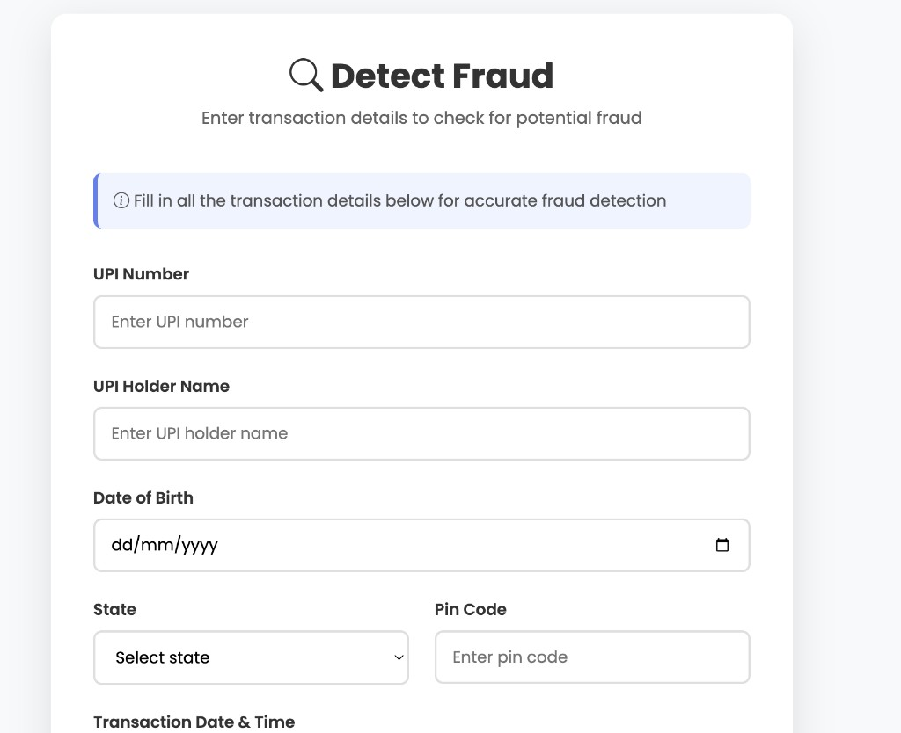

## UPI Fraud Detection

Modern Flask web app for detecting potentially fraudulent UPI transactions using a **hybrid approach**:
- **ML model score** (TensorFlow/Keras model)
- **Rule-based signals** (amount + unusual time heuristics)

### UI / UX (new)

- **Landing page**: clean hero section + primary CTAs
- **Navigation**: Home, About, Login, Detect Fraud
- **Fraud detection form**: structured inputs and user-friendly validation flow

### UI Preview

#### Home / Landing



#### Detect Fraud (form)


### Routes

- **Home / Landing**: `/` (alias: `/first`)
- **Login**: `/login`
- **Detect Fraud page**: `/prediction1`
- **Prediction submit**: `POST /detect`

### Project structure

- **`app.py`**: Flask app + model loading + fraud scoring
- **`templates/`**: HTML templates (UI)
- **`static/`**: CSS/JS assets (UI)
- **`dataset/upi_fraud_dataset.csv`**: training/evaluation dataset used by the app at startup
- **`filesuse/project_model1.h5`**: trained model loaded at runtime
- **`pyproject.toml` / `uv.lock`**: dependency management (uv)
- **`requirements.txt`**: fallback dependencies list (pip)

### Setup & run

#### Option A: uv (recommended)

```bash
uv sync
uv run python app.py
```

#### Option B: pip

```bash
python -m venv .venv
source .venv/bin/activate
pip install -r requirements.txt
python app.py
```

### Open in browser

By default the app runs on port **8080**. Open:
- `http://127.0.0.1:8080/`

### How detection works (high level)

- **Inputs** are converted into a 10-feature vector: time fields, category, UPI number, age (from DOB), amount, state, and ZIP.
- The app computes:
  - **ML score** from the trained model on scaled features
  - **rule score** from heuristics (high amount, unusual time, combinations)
- A weighted **final score** decides:
  - **FRAUD TRANSACTION** if final score \(>\) 0.5
  - **VALID TRANSACTION** otherwise


